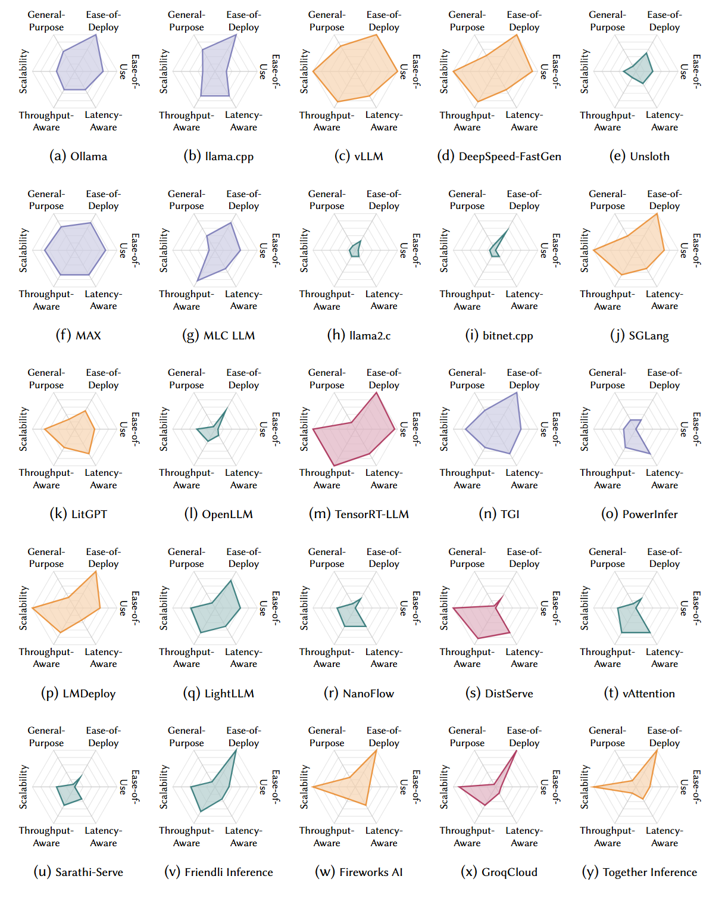
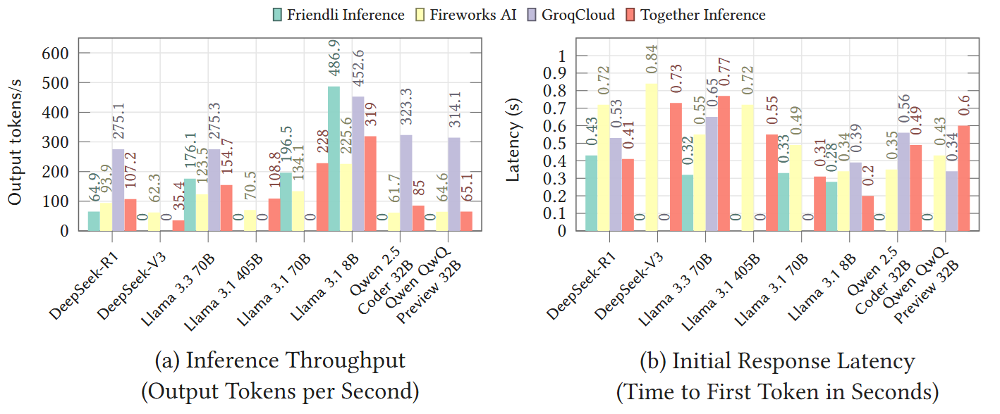
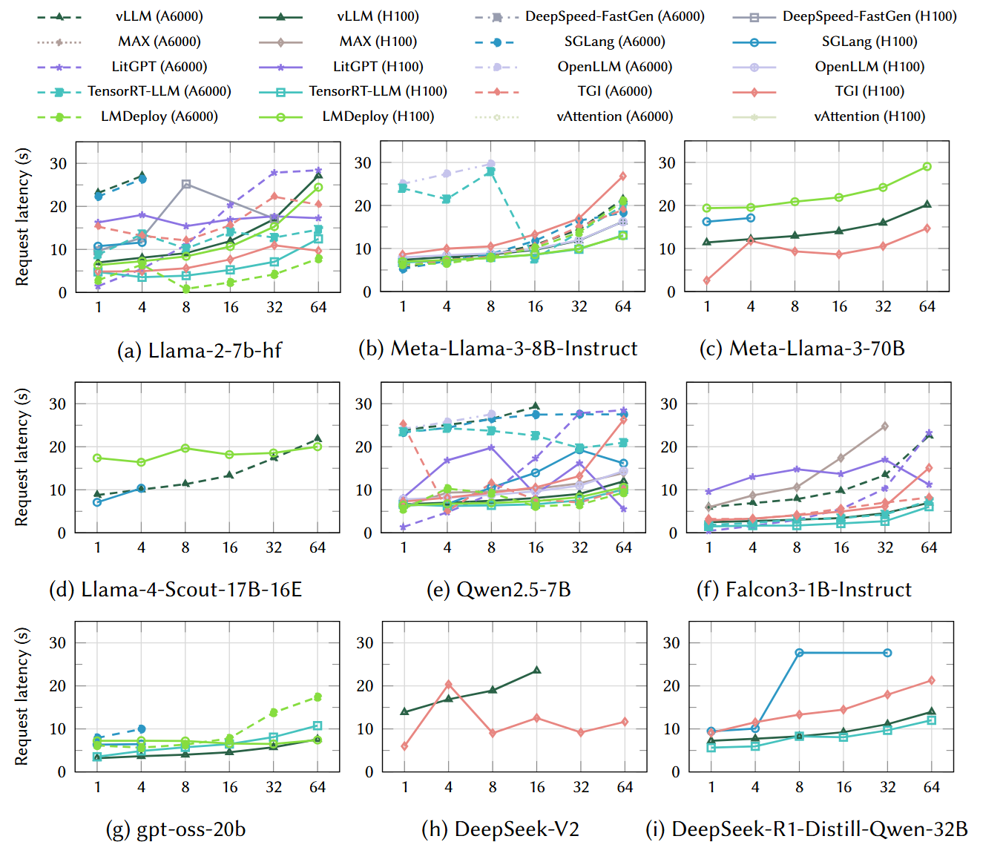
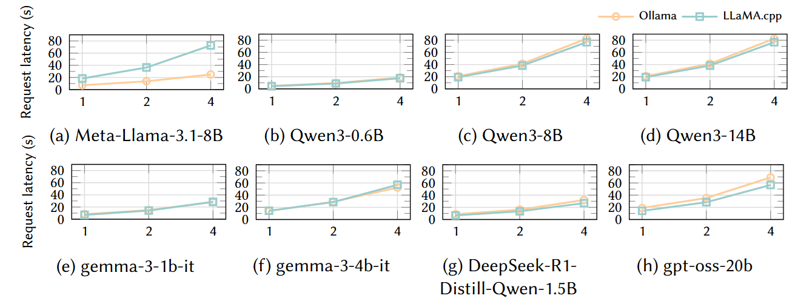

# Awesome-LLM-Inference-Engine

<p align="center">
  
</p>

Welcome to the **Awesome-LLM-Inference-Engine** repository!

A curated list of LLM inference engines, system architectures, and optimization techniques for efficient large language model serving. This repository complements our survey paper analyzing 25 inference engines, both open-source and commercial. It aims to provide practical insights for researchers, system designers, and engineers building LLM inference infrastructure.

Our work is based on the following paper:
**Survey on Inference Engines for Large Language Models: Perspectives on Optimization and Efficiency**

## 🗂 Table of Contents

- [🧠 Overview](#overview)
- [📊 Taxonomy](#taxonomy)
- [🛠 Optimization Techniques](#optimization-techniques)
- [🔓 Open Source Inference Engines](#open-source-inference-engines)
- [💼 Commercial Solutions](#commercial-solutions)
- [🧮 Comparison Table](#comparison-table)
- [🔭 Future Directions](#future-directions)
- [🤝 Contributing](#contributing)
- [⚖️ License](#license)
- [📝 Citation](#citation)
- [🔬 Experiments](#experiments)

---

## 🧠 Overview

LLM services are evolving rapidly to support complex tasks such as chain-of-thought (CoT), reasoning, AI Agent workflows. These workloads significantly increase inference cost and system complexity.

This repository categorizes and compares LLM inference engines by:

- 🖧 **Deployment type** (single-node vs multi-node)
- ⚙️ **Hardware diversity** (homogeneous vs heterogeneous)

## 📊 Taxonomy

We classify LLM inference engines along the following dimensions:

- 🧑‍💻 **Ease-of-Use:** Assesses documentation quality and community activity. Higher scores indicate better developer experience and community support.
- ⚙️ **Ease-of-Deployment:** Measures the simplicity and speed of installation using tools like pip, APT, Homebrew, Conda, Docker, source builds, or prebuilt binaries.
- 🌐 **General-purpose support:** Reflects the range of supported LLM models and hardware platforms. Higher values indicate broader compatibility across diverse model families and execution environments.
- 🏗 **Scalability:** Indicates the engine’s ability to operate effectively across edge devices, servers, and multi-node deployments. Higher scores denote readiness for large-scale or distributed workloads.
- 📈 **Throughput-aware:** Captures the presence of optimization techniques focused on maximizing throughput, such as continuous batching, parallelism, and cache reuse.
- ⚡ **Latency-aware:** Captures support for techniques targeting low latency, including stall-free scheduling, chunked prefill, and priority-aware execution.

## 🔓 Open Source Inference Engines

- [bitnet.cpp](https://github.com/microsoft/BitNet)
- [DeepSpeed-FastGen](https://github.com/deepspeedai/DeepSpeed/tree/master/blogs/deepspeed-fastgen) 🌐 [Webpage](https://www.deepspeed.ai/) 📄 [Paper](https://arxiv.org/abs/2401.08671)
- [DistServe](https://github.com/LLMServe/DistServe) 📄 [Paper](https://arxiv.org/abs/2401.09670)
- [LightLLM](https://github.com/ModelTC/lightllm) 🌐 [Webpage](https://www.light-ai.top/lightllm-blog/blog/)
- [LitGPT](https://github.com/Lightning-AI/litgpt) 🌐 [Webpage](https://lightning.ai/)
- [LMDeploy](https://github.com/InternLM/lmdeploy) 🌐 [Webpage](https://lmdeploy.readthedocs.io/en/latest/)
- [llama2.c](https://github.com/karpathy/llama2.c)
- [llama.cpp](https://github.com/ggml-org/llama.cpp)
- [MAX](https://github.com/modular/modular) 🌐 [Webpage](https://www.modular.com/max/solutions/ai-inference)
- [MLC LLM](https://github.com/mlc-ai/mlc-llm) 🌐 [Webpage](https://llm.mlc.ai/)
- [NanoFlow](https://github.com/efeslab/Nanoflow) 📄 [Paper](https://arxiv.org/abs/2408.12757)
- [Ollama](https://github.com/ollama/ollama) 🌐 [Webpage](https://ollama.com/)
- [OpenLLM](https://github.com/bentoml/OpenLLM) 🌐 [Webpage](https://www.bentoml.com/)
- [PowerInfer](https://github.com/SJTU-IPADS/PowerInfer) 📄 [Paper1](https://arxiv.org/abs/2312.12456), 📄 [Paper2](https://arxiv.org/abs/2406.06282)
- [Sarathi-Serve](https://github.com/microsoft/sarathi-serve) 📄 [Paper](https://arxiv.org/abs/2403.02310)
- [SGLang](https://github.com/sgl-project/sglang) 🌐 [Webpage](https://docs.sglang.ai/) 📄 [Paper](https://arxiv.org/abs/2312.07104)
- [TensorRT-LLM](https://github.com/NVIDIA/TensorRT-LLM) 🌐 [Webpage](https://docs.nvidia.com/tensorrt-llm/index.html)
- [TGI (Text Generation Inference)](https://github.com/huggingface/text-generation-inference) 🌐 [Webpage](https://huggingface.co/docs/text-generation-inference/index)
- [Unsloth](https://github.com/unslothai/unsloth) 🌐 [Webpage](https://unsloth.ai/)
- [vAttention](https://github.com/microsoft/vattention) 📄 [Paper](https://arxiv.org/abs/2405.04437)
- [vLLM](https://github.com/vllm-project/vllm) 🌐 [Webpage](https://docs.vllm.ai/en/latest/) 📄 [Paper](https://arxiv.org/abs/2309.06180)
- PrefillOnly 📄 [Paper](https://arxiv.org/abs/2505.07203)
- [Colossal-AI](https://github.com/hpcaitech/ColossalAI) 🌐 [Webpage](https://colossalai.org/)

## 💼 Commercial Inference Engines

- 🌐 [Fireworks AI](https://fireworks.ai/)
- 🌐 [Friendli Inference](https://friendli.ai/)
- 🌐 [GroqCloud](https://groq.com/groqcloud/)
- 🌐 [Together Inference](https://www.together.ai/)

## 📋 Overview of LLM Inference Engines
The following table compares 25 open-source and commercial LLM inference engines along multiple dimensions including organization, release status, GitHub trends, documentation maturity, model support, and community presence.

| Framework | Organization | Release Date | Open Source | GitHub Stars | Docs | SNS | Forum | Meetup |
|-----------|--------------|---------------|--------------|----------------|------|------|--------|--------|
| Ollama | Community (Ollama) | Jun. 2023 | ✅ | 136K | 🟠 | ✅ | ❌ | ✅ |
| llama.cpp | Community (ggml.ai) | Mar. 2023 | ✅ | 77.6K | 🟡 | ❌ | ❌ | ❌ |
| vLLM | Academic (vLLM Team) | Feb. 2023 | ✅ | 43.4K | ✅ | ✅ | ✅ | ✅ |
| DeepSpeed-FastGen | Big Tech (Microsoft) | Nov. 2023 | ✅ | 37.7K | ✅ | ❌ | ❌ | ✅ |
| Unsloth | Startup (Unsloth AI) | Nov. 2023 | 🔷 | 36.5K | 🟡 | ✅ | ✅ | ❌ |
| MAX | Startup (Modular Inc.) | Apr. 2023 | 🔷 | 23.8K | 🟠 | ✅ | ✅ | ✅ |
| MLC LLM | Community (MLC-AI) | Apr. 2023 | ✅ | 20.3K | 🟠 | ✅ | ❌ | ❌ |
| llama2.c | Community (Andrej Karpathy) | Jul. 2023 | ✅ | 18.3K | ❌ | ✅ | ❌ | ❌ |
| bitnet.cpp | Big Tech (Microsoft) | Oct. 2024 | ✅ | 13.6K | ❌ | ❌ | ❌ | ❌ |
| SGLang | Academic (SGLang Team) | Jan. 2024 | ✅ | 12.8K | 🟠 | ✅ | ❌ | ✅ |
| LitGPT | Startup (Lightning AI) | Jun. 2024 | ✅ | 12.0K | 🟡 | ✅ | ❌ | ✅ |
| OpenLLM | Startup (BentoML) | Apr. 2023 | 🔷 | 11.1K | ❌ | ✅ | ❌ | ❌ |
| TensorRT-LLM | Big Tech (NVIDIA) | Aug. 2023 | 🔷 | 10.1K | ✅ | ❌ | ✅ | ✅ |
| TGI | Startup (Hugging Face) | Oct. 2022 | ✅ | 10.0K | 🟠 | ❌ | ✅ | ❌ |
| PowerInfer | Academic (SJTU-IPADS) | Dec. 2023 | ✅ | 8.2K | ❌ | ❌ | ❌ | ❌ |
| LMDeploy | Startup (MMDeploy) | Jun. 2023 | ✅ | 6.0K | 🟠 | ✅ | ❌ | ❌ |
| LightLLM | Academic (Lightllm Team) | Jul. 2023 | ✅ | 3.1K | 🟠 | ✅ | ❌ | ❌ |
| NanoFlow | Academic (UW Efeslab) | Aug. 2024 | ✅ | 0.7K | ❌ | ❌ | ❌ | ❌ |
| DistServe | Academic (PKU) | Jan. 2024 | ✅ | 0.5K | ❌ | ❌ | ❌ | ❌ |
| vAttention | Big Tech (Microsoft) | May. 2024 | ✅ | 0.3K | ❌ | ❌ | ❌ | ❌ |
| Sarathi-Serve | Big Tech (Microsoft) | Nov. 2023 | ✅ | 0.3K | ❌ | ❌ | ❌ | ❌ |
| Friendli Inference | Startup (FriendliAI Inc.) | Nov. 2023 | ❌ | -- | 🟡 | ❌ | ❌ | ✅ |
| Fireworks AI | Startup (Fireworks AI Inc.) | Jul. 2023 | ❌ | -- | 🟡 | ✅ | ❌ | ❌ |
| GroqCloud | Startup (Groq Inc.) | Feb. 2024 | ❌ | -- | ❌ | ✅ | ❌ | ✅ |
| Together Inference | Startup (together.ai) | Nov. 2023 | ❌ | -- | 🟡 | ✅ | ❌ | ❌ |

*Legend:*
- Open Source: ✅ = yes, 🔷 = partial, ❌ = closed
- Docs: ✅ = detailed, 🟠 = moderate, 🟡 = simple, ❌ = missing
- SNS / Forum / Meetup: presence of Discord/Slack, forum, or events

## 🛠 Optimization Techniques

We classify LLM inference optimization techniques into several major categories based on their target performance metrics, including latency, throughput, memory, and scalability. Each category includes representative methods and corresponding research publications.

## 🧩 Batch Optimization


| Technique           | Description                                                                                             | References                                 |
| --------------------- | --------------------------------------------------------------------------------------------------------- | -------------------------------------------- |
| Dynamic Batching    | Collects user requests over a short time window to process them together, improving hardware efficiency | [Crankshaw et al. (2017)](https://www.usenix.org/conference/nsdi17/technical-sessions/presentation/crankshaw), [Ali et al. (2020)](https://ieeexplore.ieee.org/abstract/document/9355312/) |
| Continuous Batching | Forms batches incrementally based on arrival time to minimize latency                                   | [Yu et al. (2022)](https://www.usenix.org/conference/osdi22/presentation/yu), [He et al. (2024)](https://dl.acm.org/doi/abs/10.1145/3642970.3655835?casa_token=1NiNcQd9abkAAAAA:fyj6qosTlTWjIEPXBWkEoBbKuRZgHufVqlNur_4DL3M5dfla-ZRnh8JDdBCB5Nx1k0pZX15UbIo)         |
| Nano Batching       | Extremely fine-grained batching for ultra-low latency inference                                         | [Zhu et al. (2024)](https://arxiv.org/abs/2408.12757)                          |
| Chunked-prefills    | Splits prefill into chunks for parallel decoding                                                        | [Agrawal et al. (2023)](https://arxiv.org/abs/2308.16369)                      |

## 🕸 Parallelism


| Technique                            | Description                                                                         | References                                                                  |
| -------------------------------------- | ------------------------------------------------------------------------------------- | ----------------------------------------------------------------------------- |
| Data Parallelism (DP)                     | Copies the same model to multiple GPUs and splits input data for parallel execution | [Rajbhandari et al. (2020)](https://ieeexplore.ieee.org/abstract/document/9355301)                                                   |
| Fully Shared Data Parallelism (FSDP) | Shards model parameters across GPUs for memory-efficient training                   | [Zhao et al. (2023)](https://arxiv.org/abs/2304.11277)                                                          |
| Tensor Parallelism (TP)                   | Splits model tensors across devices for parallel computation                        | [Stojkovic et al. (2024)](https://arxiv.org/abs/2403.20306), [Prabhakar et al. (2024)](https://proceedings.neurips.cc/paper_files/paper/2024/hash/0f4d1fc085b7504c140e66bb26ed8842-Abstract-Conference.html)                            |
| Pipeline Parallelism (PP)                | Divides model layers across devices and executes micro-batches sequentially         | [Agrawal et al. (2023)](https://arxiv.org/abs/2308.16369), [Hu et al. (2021)](https://arxiv.org/abs/2110.14895), [Ma et al. (2024)](https://aclanthology.org/2024.naacl-industry.1/), [Yu et al. (2024)](https://dl.acm.org/doi/abs/10.1145/3688351.3689164) |

## 📦 Compression

### Quantization


| Technique             | Description                                         | References                              |
| ----------------------- | ----------------------------------------------------- | ----------------------------------------- |
| PTQ                   | Applies quantization after training                 | [Li et al. (2023)](https://arxiv.org/abs/2308.15987)                      |
| QAT                   | Retrains with quantization awareness                | [Chen et al. (2024)](https://arxiv.org/abs/2407.11062), [Liu et al. (2023)](https://arxiv.org/abs/2305.17888)   |
| AQLM                  | Maintains performance at extremely low precision    | [Egiazarian et al. (2024)](https://arxiv.org/abs/2401.06118)                |
| SmoothQuant           | Uses scale folding for normalization                | [Xiao et al. (2023)](https://proceedings.mlr.press/v202/xiao23c.html)                      |
| KV Cache Quantization | Quantizes KV cache to reduce memory usage           | [Hooper et al. (2024)](https://proceedings.neurips.cc/paper_files/paper/2024/hash/028fcbcf85435d39a40c4d61b42c99a4-Abstract-Conference.html), [Liu et al. (2024)](https://arxiv.org/abs/2402.02750) |
| EXL2                  | Implements efficient quantization format            | [EXL2](https://github.com/turboderp-org/exllamav2)                          |
| EETQ                  | Inference-friendly quantization method              | [EETQ](https://github.com/NetEase-FuXi/EETQ)                           |
| LLM Compressor        | Unified framework for quantization and pruning      | [LLM Compressor](https://github.com/vllm-project/llm-compressor)                    |
| GPTQ                  | Hessian-aware quantization minimizing accuracy loss | [Frantar et al. (2022)](https://arxiv.org/abs/2210.17323)                   |
| Marlin                | Fused quantization kernels for performance          | [Frantar et al. (2025)](https://dl.acm.org/doi/abs/10.1145/3710848.3710871)                   |
| Microscaling Format   | Compact format for fine-grained quantization        | [Rouhani et al. (2023)](https://arxiv.org/abs/2310.10537)                   |

### Pruning


| Technique             | Description                                       | References              |
| ----------------------- | --------------------------------------------------- | ------------------------- |
| cuSPARSE              | NVIDIA-optimized sparse matrix library            | [NVIDIA cuSPARSE](https://developer.nvidia.com/cusparse)         |
| Wanda                 | Importance-based weight pruning                   | [Sun et al. (2023)](https://arxiv.org/abs/2306.11695)       |
| Mini-GPTs             | Efficient inference with reduced compute          | [Valicenti et al. (2023)](https://arxiv.org/abs/2312.12682) |
| Token pruning         | Skips decoding of unimportant tokens              | [Fu et al. (2024)](https://arxiv.org/abs/2407.14057)        |
| Post-Training Pruning | Prunes weights based on importance after training | [Zhao et al. (2024)](https://arxiv.org/abs/2410.15567)      |

### Sparsity Optimization


| Technique              | Description                               | References                                                                      |
| ------------------------ | ------------------------------------------- | --------------------------------------------------------------------------------- |
| Structured Sparsity    | Removes weights in fixed patterns         | [Zheng et al. (2024)](https://proceedings.neurips.cc/paper_files/paper/2024/hash/b8f10193cab43d45df9bb810637333fd-Abstract-Conference.html), [Dong et al. (2023)](https://openreview.net/forum?id=c4m0BkO4OL)                                         |
| Dynamic Sparsity       | Applies sparsity dynamically at runtime   | [Zhang et al. (2023)](https://arxiv.org/abs/2310.08915)                                                             |
| Kernel-level Sparsity  | Optimizations at CUDA kernel level        | [Xia et al. (2023)](https://arxiv.org/abs/2309.10285), [Borstnik et al. (2014)](https://doi.org/10.1016/j.parco.2014.03.012), [xFormers (2022)](https://github.com/facebookresearch/xformers), [Xiang et al. (2025)](https://arxiv.org/abs/2504.06443) |
| Block Sparsity         | Removes weights in block structures       | [Gao et al. (2024)](https://arxiv.org/abs/2410.13276)                                                               |
| N:M Sparsity           | Maintains sparsity in fixed N:M ratios    | [Zhang et al. (2022)](https://proceedings.neurips.cc/paper_files/paper/2022/hash/06589ec9d86876508600a678f9c8f51d-Abstract-Conference.html)                                                             |
| MoE / Sparse MoE       | Activates only a subset of experts        | [Cai et al. (2024)](https://arxiv.org/abs/2407.06204), [Fedus et al. (2022)](https://www.jmlr.org/papers/v23/21-0998.html), [Du et al. (2022)](https://proceedings.mlr.press/v162/du22c.html)                        |
| Dynamic Token Sparsity | Prunes tokens based on dynamic importance | [Yang et al. (2024)](https://arxiv.org/abs/2408.07092), [Fu et al. (2024)](https://arxiv.org/abs/2407.14057)                                            |
| Contextual Sparsity    | Applies sparsity based on context         | [Liu et al. (2023)](https://proceedings.mlr.press/v202/liu23am.html), [Akhauri et al. (2024)](https://arxiv.org/abs/2406.16635)                                        |

## 🛠 Fine-Tuning


| Technique             | Description                                     | References                                  |
| ----------------------- | ------------------------------------------------- | --------------------------------------------- |
| Full-Parameter Tuning | Updates all model parameters                    | [Lv et al. (2023)](https://arxiv.org/abs/2306.09782)                            |
| LoRA                  | Injects low-rank matrices for efficient updates | [Hu et al. (2022)](https://openreview.net/forum?id=nZeVKeeFYf9), [Sheng et al. (2023) ](https://arxiv.org/abs/2311.03285)      |
| QLoRA                 | Combines LoRA with quantized weights            | [Dettmers et al. (2023)](https://proceedings.neurips.cc/paper_files/paper/2023/hash/1feb87871436031bdc0f2beaa62a049b-Abstract-Conference.html), [Zhang et al. (2023)](https://aclanthology.org/2023.wmt-1.43/) |

## 💾 Caching


| Technique      | Description                           | References                           |
| ---------------- | --------------------------------------- | -------------------------------------- |
| Prompt Caching | Caches responses to identical prompts | [Zhu et al. (2024)](https://arxiv.org/abs/2402.01173)                    |
| Prefix Caching | Reuses common prefix computations     | [Liu et al. (2024)](https://arxiv.org/abs/2403.05821), [Pan et al. (2024)](https://arxiv.org/abs/2411.19379) |
| KV Caching     | Stores KV pairs for reuse in decoding | [Pope et al. (2023)](https://proceedings.mlsys.org/paper_files/paper/2023/hash/c4be71ab8d24cdfb45e3d06dbfca2780-Abstract-mlsys2023.html)                   |

## 🔍 Attention Optimization


| Technique        | Description                                         | References                                  |
| ------------------ | ----------------------------------------------------- | --------------------------------------------- |
| PagedAttention   | Partitions KV cache into memory-efficient pages     | [Kwon et al. (2023)](https://dl.acm.org/doi/abs/10.1145/3600006.3613165)                         |
| TokenAttention   | Selects tokens dynamically for attention            | [LightLLM](https://lightllm-en.readthedocs.io/en/latest/dev/token_attention.html#tokenattention)                          |
| ChunkedAttention | Divides attention into chunks for better scheduling | [Ye et al. (2024)](https://arxiv.org/abs/2402.15220)                            |
| FlashAttention   | High-speed kernel for attention                     | [Dao et al. (2022)](https://proceedings.neurips.cc/paper_files/paper/2022/hash/67d57c32e20fd0a7a302cb81d36e40d5-Abstract-Conference.html),[Dao et al. (2023)](https://arxiv.org/abs/2307.08691), [Shah et al. (2024)](https://proceedings.neurips.cc/paper_files/paper/2024/hash/7ede97c3e082c6df10a8d6103a2eebd2-Abstract-Conference.html) |
| RadixAttention   | Merges tokens to reuse KV cache                     | [Zheng et al. (2024)](https://proceedings.neurips.cc/paper_files/paper/2024/hash/724be4472168f31ba1c9ac630f15dec8-Abstract-Conference.html)                         |
| FlexAttention    | Configurable attention via DSL                      | [Dong et al. (2024)](https://arxiv.org/abs/2412.05496)                         |
| FireAttention    | Optimized for MQA and fused heads                   | [Fireworks AI](https://fireworks.ai/)                        |

## 🎲 Sampling Optimization


| Technique | Description                                    | References                     |
| ----------- | ------------------------------------------------ | -------------------------------- |
| EAGLE     | Multi-token speculative decoding               | [Li et al. (2024a)](https://arxiv.org/abs/2401.15077), [Li et al.  (2024b)](https://arxiv.org/abs/2406.16858), [Li et al.  (2025)](https://arxiv.org/abs/2503.01840) |
| Medusa    | Tree-based multi-head decoding                 | [Cai et al. (2024)](https://arxiv.org/abs/2401.10774)             |
| ReDrafter | Regenerates output based on long-range context | [Cheng et al. (2024)](https://arxiv.org/abs/2403.09919)            |

## 🧾 Structured Outputs


| Technique                 | Description                            | References                                                     |
| --------------------------- | ---------------------------------------- | ---------------------------------------------------------------- |
| FSM / CFG                 | Rule-based decoding constraints        | [Willard et al. (2023)](https://arxiv.org/abs/2307.09702), [Geng et al. (2023)](https://arxiv.org/abs/2305.13971), [Barke et al. (2024)](https://proceedings.neurips.cc/paper_files/paper/2024/hash/1c9c85bae6161d52182d0fe2f3640512-Abstract-Conference.html) |
| Outlines / XGrammar       | Token-level structural constraints     | [Wilard et al. (2023)](https://arxiv.org/abs/2307.09702), [Dong et al. (2024)](https://arxiv.org/abs/2411.15100) |
| LM Format Enforcer        | Enforces output to follow JSON schemas | [LM Format Enforcer](https://github.com/noamgat/lm-format-enforcer)                                                  |
| llguidance / GBNF         | Lightweight grammar-based decoding     | [GBNF](https://github.com/ggml-org/llama.cpp/blob/master/grammars/README.md), [llguidance](https://github.com/guidance-ai/llguidance)                    |
| OpenAI Structured Outputs | API-supported structured outputs       | [OpenAI](https://platform.openai.com/docs/guides/structured-outputs)                                                  |
| JSONSchemaBench           | Benchmark for structured decoding      | [Geng et al. (2025)](https://arxiv.org/abs/2501.10868)                                            |
| StructTest / SoEval       | Tools for structured output validation | [Chen et al. (2024)](https://arxiv.org/abs/2412.18011), [Liu et al. (2024)](https://doi.org/10.1016/j.ipm.2024.103809)                          |


## 📚 Comparison Table

⚠️ Due to GitHub Markdown limitations, only a summarized Markdown version is available here. Please refer to the LaTeX version in the survey paper for full detail.

### 💻 Hardware Support Matrix
| Framework         | Linux | Windows | macOS | Web/API | x86-64 | ARM64/Apple Silicon | NVIDIA GPU (CUDA) | AMD GPU (ROCm/HIP) | Intel GPU (SYCL) | Google TPU | AMD Instinct | Intel Gaudi | Huawei Ascend | AWS Inferentia | Mobile / Edge                            | ETC                   |
|-------------------|--------|---------|--------|---------|--------|----------------------|--------------------|---------------------|------------------|-------------|---------------|--------------|----------------|----------------|------------------------------------------|------------------------|
| Ollama            | ✅     | ✅      | ✅     | ❌      | ✅     | ✅                   | ✅                 | ✅                  | ✅               | ❌          | ✅            | ❌           | ❌             | ❌             | ✅ (NVIDIA Jetson)                         | ❌                      |
| LLaMA.cpp         | ✅     | ✅      | ✅     | ❌      | ✅     | ✅                   | ✅                 | ✅                  | ✅               | ❌          | ✅            | ❌           | ✅             | ❌             | ✅ (Qualcomm Adreno)                      | Moore Threads MTT      |
| vLLM              | ✅     | ❌      | ❌     | ❌      | ✅     | ✅                   | ✅                 | ✅                  | ✅               | ✅          | ✅            | ✅           | ✅            | ✅             | ✅ (NVIDIA Jetson)                         | ❌                      |
| DeepSpeed-FastGen | ✅     | ✅      | ❌     | ❌      | ✅     | ❌                   | ✅                 | ❌                  | ✅               | ❌          | ✅            | ✅           | ✅             | ❌             | ❌                                        | Tecorigin SDAA         |
| unsloth           | ✅     | ✅      | ❌     | ❌      | ✅     | ❌                   | ✅                 | ❌                  | ❌               | ❌          | ❌            | ❌           | ❌             | ❌             | ❌                                        | ❌                      |
| MAX               | ✅     | ✅      | ✅     | ❌      | ✅     | ✅                   | ✅                 | ✅                  | ❌               | ❌          | ❌            | ❌           | ❌             | ❌             | ❌                                        | ❌                      |
| MLC-LLM           | ✅     | ✅      | ✅     | ❌      | ✅     | ✅                   | ✅                 | ✅                  | ✅               | ❌          | ❌            | ❌           | ❌             | ❌             | ✅ (Qualcomm Adreno, ARM Mali, Apple)     | ❌                      |
| llama2.c          | ✅     | ✅      | ✅     | ❌      | ✅     | ✅                   | ❌                 | ❌                  | ❌               | ❌          | ❌            | ❌           | ❌             | ❌             | ❌                                        | ❌                      |
| bitnet.cpp        | ✅     | ✅      | ✅     | ❌      | ✅     | ✅                   | ❌                 | ❌                  | ❌               | ❌          | ❌            | ❌           | ❌             | ❌             | ❌                                        | ❌                      |
| SGLang            | ✅     | ❌      | ❌     | ❌      | ✅     | ❌                   | ✅                 | ❌                  | ✅               | ❌          | ✅            | ✅           | ❌             | ❌             | ✅ (NVIDIA Jetson)                         | ❌                      |
| LitGPT            | ✅     | ❌      | ✅     | ❌      | ✅     | ❌                   | ✅                 | ❌                  | ❌               | ✅          | ✅            | ❌           | ❌             | ❌             | ❌                                        | ❌                      |
| OpenLLM           | ✅     | ❌      | ❌     | ❌      | ❌     | ❌                   | ✅                 | ❌                  | ❌               | ❌          | ❌            | ❌           | ❌             | ❌             | ❌                                        | ❌                      |
| TensorRT-LLM      | ✅     | ✅      | ❌     | ❌      | ❌     | ❌                   | ✅                 | ❌                  | ❌               | ❌          | ❌            | ❌           | ❌             | ❌             | ✅ (NVIDIA Jetson)                         | ❌                      |
| TGI               | ✅     | ❌      | ❌     | ❌      | ✅     | ✅                   | ✅                 | ❌                  | ✅               | ✅          | ✅            | ✅           | ❌             | ✅             | ❌                                        | ❌                      |
| PowerInfer        | ✅     | ✅      | ✅     | ❌      | ✅     | ✅                   | ✅                 | ✅                  | ❌               | ❌          | ❌            | ❌           | ❌             | ❌             | ✅ (Qualcomm Snapdragon 8)                | ❌                      |
| LMDeploy          | ✅     | ✅      | ❌     | ❌      | ✅     | ❌                   | ✅                 | ❌                  | ❌               | ❌          | ❌            | ❌           | ✅             | ❌             | ✅ (NVIDIA Jetson)                         | ❌                      |
| LightLLM          | ✅     | ❌      | ❌     | ❌      | ✅     | ❌                   | ✅                 | ❌                  | ❌               | ❌          | ❌            | ❌           | ❌             | ❌             | ❌                                        | ❌                      |
| NanoFlow          | ✅     | ❌      | ❌     | ❌      | ✅     | ❌                   | ✅                 | ❌                  | ❌               | ❌          | ❌            | ❌           | ❌             | ❌             | ❌                                        | ❌                      |
| DistServe         | ✅     | ❌      | ❌     | ❌      | ❌     | ❌                   | ✅                 | ❌                  | ❌               | ❌          | ❌            | ❌           | ❌             | ❌             | ❌                                        | ❌                      |
| vAttention        | ✅     | ❌      | ❌     | ❌      | ✅     | ❌                   | ✅                 | ❌                  | ❌               | ❌          | ❌            | ❌           | ❌             | ❌             | ❌                                        | ❌                      |
| Sarathi-Serve     | ✅     | ❌      | ❌     | ❌      | ❌     | ❌                   | ✅                 | ❌                  | ❌               | ❌          | ❌            | ❌           | ❌             | ❌             | ❌                                        | ❌                      |
| Friendli Inference| ❌     | ❌      | ❌     | ✅      | ❌     | ❌                   | ✅                 | ❌                  | ❌               | ❌          | ❌            | ❌           | ❌             | ❌             | ❌                                        | ❌                      |
| Fireworks AI      | ❌     | ❌      | ❌     | ✅      | ❌     | ❌                   | ✅                 | ❌                  | ❌               | ❌          | ✅            | ❌           | ❌             | ❌             | ❌                                        | ❌                      |
| GroqCloud         | ❌     | ❌      | ❌     | ✅      | ❌     | ❌                   | ❌                 | ❌                  | ❌               | ❌          | ❌            | ❌           | ❌             | ❌             | ❌                                        | Groq LPU               |
| Together Inference| ❌     | ❌      | ❌     | ✅      | ❌     | ❌                   | ✅                 | ❌                  | ❌               | ❌          | ❌            | ❌           | ❌             | ❌             | ❌                                        | ❌                      |

- **NVIDIA GPU**: [NVIDIA A100](https://www.nvidia.com/en-us/data-center/a100/), [NVIDIA H100](https://www.nvidia.com/en-us/data-center/h100/?ncid=no-ncid), [NVIDIA H200](https://www.nvidia.com/en-us/data-center/h200/?ncid=no-ncid) etc.
- **AMD GPU**: [AMD Radeon](https://www.amd.com/en/products/graphics/desktops/radeon.html), etc.
- **Intel GPU**: [Intel Arc](https://www.intel.com/content/www/us/en/products/details/discrete-gpus/arc.html), etc.
- **Google TPU**: [TPU v4](https://cloud.google.com/tpu/docs/v4), [TPU v5e](https://cloud.google.com/tpu/docs/v5e), [TPU v5p](https://cloud.google.com/tpu/docs/v5p), etc.
- **AMD Instinct**: [Instinct MI200](https://www.amd.com/en/products/accelerators/instinct/mi200.html), [Instinct MI300X](https://www.amd.com/en/products/accelerators/instinct/mi300/mi300x.html), etc.
- **Intel Gaudi**: [Intel Gaudi 2](https://www.intel.com/content/www/us/en/products/details/processors/ai-accelerators/gaudi2.html), Intel [Gaudi 3](https://www.intel.com/content/www/us/en/products/details/processors/ai-accelerators/gaudi.html)
- **Huawei Ascend**: [Ascend series](https://e.huawei.com/ph/products/computing/ascend)
- **AWS Inferentia**: [Inferentia](https://awsdocs-neuron.readthedocs-hosted.com/en/latest/general/arch/neuron-hardware/inferentia.html), [Inferentia 2](https://awsdocs-neuron.readthedocs-hosted.com/en/latest/general/arch/neuron-hardware/inferentia2.html)
- **Mobile/Edge**: [NVIDIA Jetson](https://www.nvidia.com/en-us/autonomous-machines/embedded-systems/), [Qualcomm Snapdragon](https://www.qualcomm.com/snapdragon/overview), etc.
- **ETC**: [Moore Threads MTT](https://en.mthreads.com/), [Tecorigin SDAA](http://www.tecorigin.com/), [Groq LPU](https://groq.com/the-groq-lpu-explained/)

### 🧭 Deployment Scalability vs. Hardware Diversity

|                        | 🧩 Heterogeneous Devices                                                                                                  | ⚙️ Homogeneous Devices                                                                                                   |
|------------------------|---------------------------------------------------------------------------------------------------------------------------|--------------------------------------------------------------------------------------------------------------------------|
| 🖥 **Single-Node**      | llama.cpp, MAX, MLC LLM, Ollama, PowerInfer, TGI                                                                          | bitnet.cpp, LightLLM, llama2.c, NanoFlow, OpenLLM, Sarathi-Serve, Unsloth, vAttention, Friendli Inference                |
| 🖧 **Multi-Node**       | DeepSpeed-FastGen, LitGPT, LMDeploy, SGLang, vLLM, Fireworks AI, Together Inference                                       | DistServe, TensorRT-LLM, GroqCloud                                                                                       |

*Legend:*
- **🖥 Single-Node**: Designed for single-device execution
- **🖧 Multi-Node**: Supports distributed or multi-host serving
- **🧩 Heterogeneous Devices**: Supports diverse hardware (CPU, GPU, accelerators)
- **⚙️ Homogeneous Devices**: Optimized for a single hardware class

### 📌 Optimization Coverage Matrix

| Framework              | Dynamic Batching | Continuous Batching | Nano Batching | Chunked-prefills | Data Parallelism | FSDP | Tensor Parallelism | Pipeline Parallelism | Quantization | Pruning | Sparsity | LoRA | Prompt Caching | Prefix Caching | KV Caching | PagedAttention | vAttention | FlashAttention | RadixAttention | FlexAttention | FireAttention | Speculative Decoding | Guided Decoding |
|------------------------|------------------|----------------------|----------------|------------------|------------------|------|---------------------|------------------------|--------------|---------|----------|------|----------------|----------------|------------|----------------|-------------|----------------|----------------|----------------|----------------|------------------------|------------------|
| Ollama                 | ❌               | ❌                   | ❌             | ❌               | ❌               | ❌   | ✅                  | ✅                     | ✅           | ✅      | ✅       | ✅   | ✅             | ❌             | ✅         | ❌             | ❌          | ✅             | ❌             | ❌             | ❌             | ✅                     | ✅               |
| LLaMA.cpp              | ❌               | ✅                   | ❌             | ❌               | ❌               | ❌   | ✅                  | ✅                     | ✅           | ❌      | ✅       | ✅   | ✅             | ❌             | ✅         | ❌             | ❌          | ✅             | ❌             | ❌             | ❌             | ✅                     | ✅               |
| vLLM                   | ❌               | ✅                   | ❌             | ✅               | ✅               | ✅   | ✅                  | ✅                     | ✅           | ✅      | ✅       | ✅   | ❌             | ✅             | ✅         | ✅             | ❌          | ✅             | ❌             | ❌             | ❌             | ✅                     | ✅               |
| DeepSpeed-FastGen      | ❌               | ✅                   | ❌             | ✅               | ✅               | ✅   | ✅                  | ✅                     | ✅           | ✅      | ✅       | ✅   | ❌             | ❌             | ✅         | ✅             | ❌          | ✅             | ❌             | ❌             | ❌             | ❌                     | ❌               |
| unsloth                | ❌               | ❌                   | ❌             | ❌               | ❌               | ❌   | ❌                  | ❌                     | ✅           | ❌      | ❌       | ✅   | ❌             | ❌             | ✅         | ❌             | ❌          | ✅             | ❌             | ✅             | ❌             | ❌                     | ❌               |
| MAX                    | ❌               | ✅                   | ❌             | ✅               | ❌               | ❌   | ✅                  | ❌                     | ✅           | ❌      | ✅       | ✅   | ❌             | ✅             | ✅         | ✅             | ❌          | ✅             | ❌             | ❌             | ❌             | ✅                     | ✅               |
| MLC-LLM                | ❌               | ✅                   | ❌             | ✅               | ❌               | ❌   | ✅                  | ✅                     | ✅           | ❌      | ✅       | ❌   | ❌             | ✅             | ✅         | ✅             | ❌          | ❌             | ❌             | ❌             | ❌             | ✅                     | ✅               |
| llama2.c               | ❌               | ❌                   | ❌             | ❌               | ❌               | ❌   | ❌                  | ❌                     | ✅           | ❌      | ❌       | ❌   | ❌             | ❌             | ✅         | ❌             | ❌          | ❌             | ❌             | ❌             | ❌             | ❌                     | ❌               |
| bitnet.cpp             | ❌               | ❌                   | ❌             | ❌               | ❌               | ❌   | ❌                  | ❌                     | ✅           | ❌      | ✅       | ❌   | ❌             | ❌             | ✅         | ❌             | ❌          | ❌             | ❌             | ❌             | ❌             | ❌                     | ❌               |
| SGLang                 | ❌               | ✅                   | ❌             | ✅               | ✅               | ✅   | ✅                  | ❌                     | ✅           | ✅      | ✅       | ✅   | ❌             | ✅             | ✅         | ✅             | ❌          | ❌             | ✅             | ❌             | ✅             | ✅                     | ✅               |
| LitGPT                 | ❌               | ✅                   | ❌             | ❌               | ✅               | ✅   | ✅                  | ❌                     | ✅           | ❌      | ✅       | ✅   | ❌             | ❌             | ✅         | ❌             | ❌          | ✅             | ❌             | ❌             | ❌             | ✅                     | ❌               |
| OpenLLM                | ❌               | ✅                   | ❌             | ❌               | ✅               | ❌   | ❌                  | ❌                     | ✅           | ❌      | ❌       | ❌   | ❌             | ❌             | ❌         | ❌             | ❌          | ❌             | ❌             | ❌             | ❌             | ❌                     | ❌               |
| TensorRT-LLM           | ✅               | ✅                   | ❌             | ✅               | ✅               | ❌   | ✅                  | ✅                     | ✅           | ✅      | ✅       | ✅   | ✅             | ❌             | ✅         | ✅             | ❌          | ❌             | ❌             | ❌             | ✅             | ✅                     | ✅               |
| TGI                    | ❌               | ✅                   | ❌             | ❌               | ❌               | ❌   | ✅                  | ❌                     | ✅           | ✅      | ✅       | ✅   | ❌             | ✅             | ✅         | ✅             | ❌          | ✅             | ❌             | ❌             | ✅             | ✅                     | ✅               |
| PowerInfer             | ❌               | ✅                   | ❌             | ❌               | ✅               | ❌   | ❌                  | ✅                     | ✅           | ❌      | ✅       | ✅   | ❌             | ✅             | ❌         | ❌             | ✅          | ❌             | ❌             | ❌             | ✅             | ✅                     | ✅               |
| LMDeploy               | ❌               | ✅                   | ❌             | ✅               | ❌               | ❌   | ✅                  | ❌                     | ✅           | ✅      | ✅       | ✅   | ❌             | ✅             | ✅         | ✅             | ❌          | ❌             | ❌             | ❌             | ❌             | ✅                     | ✅               |
| LightLLM               | ✅               | ❌                   | ❌             | ✅               | ❌               | ❌   | ✅                  | ❌                     | ✅           | ❌      | ✅       | ❌   | ✅             | ❌             | ✅         | ❌             | ❌          | ✅             | ❌             | ❌             | ❌             | ✅                     | ✅               |
| NanoFlow               | ❌               | ✅                   | ✅             | ✅               | ✅               | ❌   | ❌                  | ❌                     | ❌           | ❌      | ❌       | ❌   | ❌             | ❌             | ✅         | ❌             | ❌          | ❌             | ❌             | ❌             | ❌             | ❌                     | ❌               |
| DistServe              | ✅               | ✅                   | ❌             | ✅               | ❌               | ❌   | ✅                  | ✅                     | ❌           | ❌      | ❌       | ❌   | ❌             | ✅             | ✅         | ❌             | ✅          | ❌             | ❌             | ❌             | ❌             | ❌                     | ❌               |
| vAttention             | ❌               | ✅                   | ❌             | ❌               | ✅               | ❌   | ✅                  | ✅                     | ✅           | ✅      | ✅       | ✅   | ❌             | ❌             | ✅         | ✅             | ✅          | ✅             | ❌             | ❌             | ❌             | ❌                     | ❌               |
| Sarathi-Serve          | ❌               | ❌                   | ❌             | ✅               | ❌               | ❌   | ✅                  | ✅                     | ❌           | ❌      | ✅       | ❌   | ❌             | ✅             | ✅         | ✅             | ❌          | ✅             | ❌             | ❌             | ❌             | ❌                     | ❌               |
| Friendli Inference     | -                | ✅                   | -              | -                | -                | -    | ✅                  | ✅                     | ✅           | -       | ✅       | ✅   | -              | -              | -          | -              | ❌          | -              | -              | ❌             | ✅             | ✅                     | ✅               |
| Fireworks AI           | -                | ✅                   | -              | -                | -                | -    | -                   | -                      | ✅           | ✅      | ✅       | ✅   | ✅             | -              | ✅         | -              | ❌          | -              | -              | ❌             | ✅             | ✅                     | ✅               |
| GroqCloud              | -                | -                    | -              | -                | ✅               | -    | ✅                  | ✅                     | ✅           | ✅      | ✅       | -    | -              | -              | -          | -              | ❌          | -              | -              | ❌             | ✅             | ✅                     | ✅               |
| Together Inference     | -                | -                    | -              | -                | -                | ✅   | -                   | -                      | ✅           | -       | ✅       | ✅   | ✅             | -              | -          | -              | ❌          | ✅             | -              | ❌             | ✅             | ✅                     | ✅               |

### 🧮 Numeric Precision Support Matrix

| Framework           | FP32 | FP16 | FP8  | FP4  | NF4  | BF16 | INT8 | INT4 | MXFP8 | MXFP6 | MXFP4 | MXINT8 |
|---------------------|------|------|------|------|------|------|------|------|--------|--------|--------|---------|
| Ollama              | ✅   | ✅   | ✅   | ❌   | ❌   | ✅   | ✅   | ❌   | ❌     | ❌     | ❌     | ❌      |
| LLaMA.cpp           | ✅   | ✅   | ❌   | ❌   | ❌   | ❌   | ✅   | ✅   | ❌     | ❌     | ❌     | ❌      |
| vLLM                | ✅   | ✅   | ✅   | ✅   | ✅   | ✅   | ✅   | ✅   | ❌     | ❌     | ❌     | ❌      |
| DeepSpeed-FastGen   | ✅   | ✅   | ❌   | ✅   | ❌   | ❌   | ✅   | ✅   | ❌     | ❌     | ❌     | ❌      |
| unsloth             | ✅   | ✅   | ✅   | ❌   | ✅   | ✅   | ✅   | ✅   | ❌     | ❌     | ❌     | ❌      |
| MAX                 | ✅   | ✅   | ✅   | ❌   | ❌   | ✅   | ✅   | ❌   | ❌     | ❌     | ❌     | ❌      |
| MLC-LLM             | ✅   | ✅   | ✅   | ❌   | ❌   | ❌   | ✅   | ✅   | ❌     | ❌     | ❌     | ❌      |
| llama2.c            | ✅   | ❌   | ❌   | ❌   | ❌   | ❌   | ✅   | ❌   | ❌     | ❌     | ❌     | ❌      |
| bitnet.cpp          | ✅   | ✅   | ❌   | ❌   | ❌   | ✅   | ✅   | ❌   | ❌     | ❌     | ❌     | ❌      |
| SGLang              | ✅   | ✅   | ✅   | ✅   | ✅   | ✅   | ✅   | ✅   | ❌     | ❌     | ❌     | ❌      |
| LitGPT              | ✅   | ✅   | ❌   | ✅   | ✅   | ❌   | ✅   | ❌   | ❌     | ❌     | ❌     | ❌      |
| OpenLLM             | ✅   | ✅   | ❌   | ❌   | ❌   | ❌   | ✅   | ❌   | ❌     | ❌     | ❌     | ❌      |
| TensorRT-LLM        | ✅   | ✅   | ✅   | ✅   | ❌   | ✅   | ✅   | ✅   | ✅     | ❌     | ✅     | ❌      |
| TGI                 | ✅   | ✅   | ✅   | ✅   | ✅   | ✅   | ❌   | ❌   | ❌     | ❌     | ❌     | ❌      |
| PowerInfer          | ✅   | ✅   | ❌   | ❌   | ❌   | ✅   | ✅   | ✅   | ❌     | ❌     | ❌     | ❌      |
| LMDeploy            | ✅   | ✅   | ✅   | ❌   | ❌   | ✅   | ✅   | ✅   | ❌     | ❌     | ❌     | ❌      |
| LightLLM            | ✅   | ✅   | ❌   | ❌   | ❌   | ✅   | ✅   | ❌   | ❌     | ❌     | ❌     | ❌      |
| NanoFlow            | ❌   | ✅   | ❌   | ❌   | ❌   | ✅   | ❌   | ❌   | ❌     | ❌     | ❌     | ❌      |
| DistServe           | ✅   | ✅   | ❌   | ❌   | ❌   | ❌   | ❌   | ❌   | ❌     | ❌     | ❌     | ❌      |
| vAttention          | ✅   | ✅   | ✅   | ❌   | ❌   | ✅   | ✅   | ✅   | ❌     | ❌     | ❌     | ❌      |
| Sarathi-Serve       | ✅   | ✅   | ❌   | ❌   | ❌   | ✅   | ❌   | ❌   | ❌     | ❌     | ❌     | ❌      |
| Friendli Inference  | ✅   | ✅   | ✅   | ❌   | ❌   | ✅   | ✅   | ✅   | ❌     | ❌     | ❌     | ❌      |
| Fireworks AI        | ❌   | ✅   | ✅   | ❌   | ❌   | ❌   | ❌   | ❌   | ❌     | ❌     | ❌     | ❌      |
| GroqCloud           | ✅   | ✅   | ❌   | ❌   | ❌   | ❌   | ✅   | ❌   | ❌     | ❌     | ❌     | ❌      |
| Together Inference  | ❌   | ✅   | ✅   | ❌   | ❌   | ❌   | ❌   | ✅   | ❌     | ❌     | ❌     | ❌      |


### 🧭 Radar Chart: Multi-Dimensional Evaluation of LLM Inference Engines

This radar chart compares 25 inference engines across six key dimensions: general-purpose support, ease of use, ease of deployment, latency awareness, throughput awareness, and scalability.



### 📈 Commercial Inference Engine Performance Comparison

- Source: [Artificial Analysis](https://artificialanalysis.ai/)

### 💲 Commercial Inference Engine Pricing by Model (USD per 1M tokens)

| Model | Friendli AI† | Fireworks AI | GroqCloud | Together AI‡ |
|-------|--------------|--------------|-----------|---------------|
| DeepSeek-R1 | 3.00 / 7.00 | 3.00 / 8.00 | 0.75* / 0.99* | 3.00 / 7.00 |
| DeepSeek-V3 | - / - | 0.90 / 0.90 | - / - | 1.25 / 1.25 |
| Llama 3.3 70B | 0.60 / 0.60 | - / - | 0.59 / 0.79 | 0.88 / 0.88 |
| Llama 3.1 405B | - / - | 3.00 / 3.00 | - / - | 3.50 / 3.50 |
| Llama 3.1 70B | 0.60 / 0.60 | - / - | - / - | 0.88 / 0.88 |
| Llama 3.1 8B | 0.10 / 0.10 | - / - | 0.05 / 0.08 | 0.18 / 0.18 |
| Qwen 2.5 Coder 32B | - / - | - / - | 0.79 / 0.79 | 0.80 / 0.80 |
| Qwen QwQ Preview 32B | - / - | - / - | 0.29 / 0.39 | 1.20 / 1.20 |

- † Llama is Instruct model 
- ‡ Turbo mode price   
- \* DeepSeek-R1 Distill Llama 70B

### 💲 Commercial Inference Engine Pricing by Hardware Type (USD per hour per device)

| Hardware | Friendli AI | Fireworks AI | GroqCloud | Together AI |
|----------|-------------|--------------|-----------|---------------|
| NVIDIA A100 80GB | 2.9 | 2.9 | - | 2.56 |
| NVIDIA H100 80GB | 5.6 | 5.8 | - | 3.36 |
| NVIDIA H200 141GB | - | 9.99 | - | 4.99 |
| AMD MI300X | - | 4.99 | - | - |
| Groq LPU | - | - | - | - |


## 🔬 Experiments

This section presents an empirical study of 21 open-source LLM inference engines across both server-class GPUs and edge devices.
All benchmarks were executed through a unified OpenAI-compatible interface, and GuideLLM (https://github.com/vllm-project/guidellm) 
was used to generate load, measure latency, and ensure reproducible evaluation across engines.

### ⚙️ Experimental Setup

**Hardware**
- **Server A (High-End)**: 8× NVIDIA H100
- **Server B (Mid-Range)**: 6× NVIDIA RTX A6000
- **Edge Device**: NVIDIA Jetson Orin AGX 32GB

**Engine Installation Notes**

All 21 engines were installed and tested individually.
- **Easy**: pip/uv-based engines (Ollama, LLaMA.cpp, vLLM, etc.)
- **Medium**: container-based engines (TGI, TensorRT-LLM, MAX)
- **Hard**: engines requiring extra build steps or patches (MLC LLM, DistServe, NanoFlow)

**Model Execution Feasibility**

Not all engines supported the same models across devices.
Some engines:

- ran on A6000 but not H100 (kernel/runtime mismatch)
- failed on multinode-only configurations
- lacked Jetson/ARM builds

Only Ollama and LLaMA.cpp ran reliably on Jetson.

### 📏 Evaluation Methodology
All requests were issued using GuideLLM, with a consistent API schema for fair comparison.

**Metrics:**
- TTFT (Time To First Token)
- TBT (Time Between Tokens)
- Requests/s
- Token Throughput
- End-to-End Latency
- Success Rate under concurrency

**Workload design:**
- Varying prompt lengths → TTFT
- Varying output lengths → TBT
- Increasing concurrency → throughput, stability
- Server tests: 30-second runs
- Edge tests: 240-second runs
- All engines evaluated using default settings (no manual tuning)

### 🔢 Quantized Model Results (Server)

Evaluated primarily on Ollama, LLaMA.cpp, and MLC LLM with 4-bit models.

**TTFT**
- TTFT increases linearly with prompt length across engines.
- LLaMA.cpp on H100 had competitive TTFT but occasionally unstable.
- MLC LLM showed fast TTFT in some cases but poor overall reliability.

**TBT**
- H100 delivered 2× faster decoding than A6000.
- For larger models (e.g., Qwen3-32B), several engines failed as output length increased.

**Throughput Under Concurrency**
- Small models → similar throughput across engines
- Medium models → Ollama (H100) consistently highest and most stable
- LLaMA.cpp → good decoding speed but high failure rate at concurrency ≥ 8

**Token Throughput**
Meta-Llama-3.1-8B:
- Ollama (H100): ~588 tok/s
- LLaMA.cpp (H100): ~431 tok/s

**End-to-End Latency**

Most engines converge around 15–17 seconds at concurrency 16.

<p align="center">
  
</p>


**Stability**
- Medium/large models break down quickly at higher concurrency (1–10% success at ≥16).
- MLC LLM becomes unusable beyond concurrency 4.

### 💡 Full-Precision Model Results (Server)

Focus on high-performance engines:
TensorRT-LLM, vLLM, LMDeploy, TGI.

**TTFT**
- TensorRT-LLM consistently lowest TTFT.
- vLLM, LMDeploy, TGI stable across all prompts/models.

**TBT**
- TensorRT-LLM fastest due to fused kernels and optimized attention.
- Others show moderate, predictable scaling.

**Requests/s (Llama-2-7B)**
Concurrency 64:
- TensorRT-LLM: 3.68 req/s
- LMDeploy: 2.57 req/s
- vLLM: 2.00 req/s
- TGI: 2.37 req/s

**Token Throughput**
(Llama-2-7B, concurrency 64)
- TensorRT-LLM: 7,535 tok/s
- LMDeploy: 4,246 tok/s
- vLLM: 4,107 tok/s
- TGI: 3,058 tok/s

Some models (e.g., Qwen2.5) favor LMDeploy or vLLM due to kernel specialization.

**Latency & Stability**
- TensorRT-LLM lowest latency, vLLM/LMDeploy/TGI close behind.
- Most other engines failed to maintain concurrency stability.

<p align="center">
  
</p>


### 📱 Edge Device Results (Jetson Orin)

Only Ollama and LLaMA.cpp passed all tests.

**TTFT**

Llama-3.1-8B:

- Ollama is 2.5–3.5× faster than LLaMA.cpp

Small models (<1B–2B):
- LLaMA.cpp is faster

8B+ models: TTFT grows to 30–40s → impractical.

**TBT**
- Small models → LLaMA.cpp wins
- Medium models → Ollama wins
- Differences smaller than TTFT gap

**Throughput**

8B models:
- Ollama: ~0.15 req/s
- LLaMA.cpp: ~0.05 req/s

14B models:
- ~0.07 req/s → not usable

**Latency**
Concurrency 4:
- 8B models: 25–70s
- 14B models: >130s

Edge-viable range: 1B–4B models, concurrency 1–2

<p align="center">
  
</p>


### 🧭 Overall Findings
**Server**

- Top performance: TensorRT-LLM
- Best all-rounders: vLLM, LMDeploy, TGI
- Unstable under load: SGLang, LitGPT, DeepSpeed-FastGen (without tuning)
- Large models still unstable under high concurrency on a single node

**Edge**

- 8B+ models not suitable
- Practical range is 1B–4B models
- Ollama better for interactive use
- LLaMA.cpp better for small-model, high-locality workloads

**Key Takeaways**

- Engine performance varies significantly by model type, hardware, and concurrency.
- Many engines fail silently at scale; stability is as important as raw throughput.
- TensorRT-LLM dominates optimized full-precision inference, while vLLM/LMDeploy/TGI provide balanced performance without special builds.
- Edge inference remains heavily constrained by memory and latency.


## 🔭 Future Directions

LLM inference engines are rapidly evolving, but several important challenges remain open. Below we summarize key future directions and how they relate to system and model design.

### 1. Long-context Inference and Memory Management

Modern LLMs are pushing context windows from tens of thousands to millions of tokens, which causes KV cache size and memory usage to grow dramatically. This trend raises several needs:

- **KV cache optimization:** Techniques like paged KV management, hierarchical caching, CPU offloading, and memory-efficient attention (e.g., paged attention, chunked prefill) aim to reduce internal fragmentation and improve time-to-first-token (TTFT).
- **Context compression:** Methods such as coarse-to-fine context compression and budget-controlled token selection can shrink prompts by up to tens of times without major performance loss, though they must carefully avoid semantic drift.
- **Streaming and unbounded inputs:** Real-world services rely on multi-turn dialogue and streaming generation, effectively requiring unbounded input handling. Sliding windows and streaming attention approaches with relative position encodings (e.g., RoPE, ALiBi) enable infinite-length streams without retraining, but still struggle with tasks that require very long-range dependencies.
- **Chunk-based aggregation:** Some engines (e.g., vLLM) split long sequences into chunks, pool each chunk into embeddings, and then average them. This is simple and efficient but limits cross-chunk interaction and global reasoning.

Overall, long-context support requires combining cache management, context compression, and streaming attention rather than relying on a single technique.

---

### 2. Complex Logical Reasoning and CoT-friendly Inference

LLMs are increasingly used for complex reasoning tasks, such as multi-step problem solving, autonomous chain-of-thought (CoT) generation, and tool-based workflows:

- **CoT explosion:** CoT and multi-turn refinement can dramatically increase token usage in the decode phase, causing quasi-linear growth in FLOPs and memory traffic. KV cache capacity and bandwidth become critical bottlenecks.
- **KV optimization for reasoning:** Low-rank and sparse KV caching (e.g., keeping Keys in compressed form and reconstructing Values on demand) can mitigate memory pressure and bandwidth costs in long reasoning chains.
- **Queue interference:** Long CoT requests can cause head-of-line blocking, degrading TTFT for short, interactive requests. Splitting prefill and decode across heterogeneous devices and batching them separately helps reduce interference and maintain responsiveness.
- **Conciseness vs. verbosity:** Overly verbose CoT does not always improve answer quality and can lead to bloated responses. Metrics such as “correct-and-concise” and reward shaping that penalize unnecessary tokens are important for practical deployments.
- **Session continuity:** Engines must support streaming outputs, multi-turn session management, and stable handling of long reasoning flows as first-class concerns.

---

### 3. Application-driven Engine Design and Low-rank Decomposition

Inference engines must balance application requirements against system constraints:

- **Latency vs. throughput:** Interactive applications (chatbots, translators, copilots) prioritize latency, while batch workloads (e.g., offline translation or summarization) prioritize throughput. Engines should expose tunable profiles and scheduling policies for different scenarios.
- **Model-level compression with low-rank decomposition:** LLMs exhibit relatively low computational density for their parameter scale, making pure quantization/pruning insufficient. Low-rank decomposition bridges this gap by:
  - Factorizing weight matrices/tensors into low-rank components using SVD or tensor techniques (Tensor Train, Tensor Ring, Tucker).
  - Applying rank-constrained training or post-hoc decomposition to control the latency–accuracy trade-off.
- **Two stages of application:** Low-rank structure can be imposed:
  - During **pre-training**, by parameterizing layers directly in low-rank form.
  - As **post-training** compression, where layer-wise ranks are tuned to match hardware and latency targets.
- **Hardware-aware co-design:** To unlock full benefits:
  - Ranks and decomposition dimensions must consider warp size, memory bank layout, shared memory capacity, and tensor core block sizes.
  - Multiple small matrix multiplications should be fused into single kernels or reorganized into tensor-core-friendly blocks to avoid kernel launch overhead and global memory thrashing.
  - Schedulers should reorder the computation graph so low-reuse regions stay in faster memories (registers/shared memory), alleviating bandwidth bottlenecks.

Low-rank decomposition thus complements engine-level optimization. Engines that already support post-training quantization (e.g., via libraries like Unsloth) can further improve efficiency by adding low-rank modules, enabling personal and edge deployment of larger models.

---

### 4. LLM Alignment at Training and Inference Time

As LLMs spread across domains, **alignment** (usefulness, safety, policy compliance, tone) becomes as important as raw task accuracy:

- **Alignment methods:**
  - **SFT → RLHF:** Supervised fine-tuning followed by reinforcement learning from human feedback with reward models and PPO.
  - **RLAIF / Constitutional AI:** Replacing human feedback with AI judges, guided by constitutions or policies.
  - **DPO and related methods:** Directly optimizing the policy from preference pairs without explicit reward models or PPO.
- **Frameworks and tooling:** Large-scale alignment frameworks (Verl, LlamaRL, TRL, OpenRLHF, DeepSpeed-Chat) combine RLHF, DPO, and AI feedback in scalable pipelines.
- **Impact on inference:** Well-aligned models:
  - Reduce retries and downstream filtering by matching user intent and policies more reliably.
  - Produce more stable output formats and lengths, simplifying batch scheduling and response shaping.

Alignment does not reduce parameter counts, so engines must still combine alignment-aware models with quantization, KV caching, and smart batching to meet real-time service goals.

---

### 5. Hardware-aware Fusion and Mixed-precision Kernels

Generative AI workloads based on Transformers and diffusion models demand more sophisticated kernel design:

- **Advanced fusion:** Beyond simple operator fusion, kernels like FlashAttention-3 use hardware-conscious tiling and memory layouts tuned to GPUs such as NVIDIA H100.
- **Microscaling datatypes:** Emerging low-precision formats (FP4, MXFP4, NVFP4) enable:
  - Faster GEMM operations and lower memory footprint.
  - Competitive training and inference accuracy when combined with robust scaling, gradient estimation, and outlier handling (e.g., Random Hadamard transforms).
- **MoE-friendly quantization:** For mixture-of-experts (MoE) models, quantizing expert weights into FP4/MXFP4 can dramatically reduce memory usage, storing parameters effectively at around four bits while preserving utility.
- **Engine requirements:** To deploy these formats in production, inference engines must:
  - Provide FP4/MXFP4-aware kernels and cache layouts.
  - Integrate with hardware-specific features of modern accelerators (e.g., Blackwell, H100) to maximize utilization.
  - Support mixed-precision pipelines that combine ultra-low precision weights with higher-precision activations or accumulators where needed.

---

### 6. On-device Inference and Knowledge Distillation

The demand for **on-device** and **on-premise** inference is growing due to privacy, latency, and offline requirements:

- **From LLMs to SLMs:** Compact models (e.g., Llama 3.2, Gemma, Phi-3, Pythia) enable LLM-style capabilities on embedded systems, mobile devices, IoT endpoints, and single-GPU setups.
- **Edge-specific optimizations:**
  - Tolerance-aware compression, I/O recomputation pipelines, and chunk lifecycle management for mobile hardware.
  - Collaborative inference across multiple edge devices to share computational workloads.
  - 4-bit quantization and offloading of model weights, activations, and KV caches between GPU, CPU, and disk for resource-constrained environments.
- **Knowledge distillation (KD):**
  - KD compresses large “teacher” models into smaller “student” models while maintaining accuracy.
  - Different knowledge sources include labels, probability distributions, intermediate features, curated synthetic data, feedback signals, and self-filtered outputs.
  - Distillation can be applied during fine-tuning or over the full pre-training pipeline, via supervised learning, divergence-based losses, or RL-style optimization.
  - White-box KD leverages teacher logits and internal states for fine-grained alignment, while black-box KD (e.g., via APIs) relies only on final outputs and tends to be less sample-efficient.

Engines that support training loops can integrate KD directly; otherwise, they can still support light-weight distillation via student generation from teacher outputs.

---

### 7. Heterogeneous Hardware and Accelerator Support

LLM inference is no longer GPU-only. TPUs, NPUs, FPGAs, ASICs, and PIM/NDP platforms are increasingly relevant:

- **Diverse accelerators:** AWS Inferentia, Google TPU, AMD Instinct MI300X, Furiosa, Cerebras, and others offer varied architectures and memory systems.
- **Hardware-specific strategies:**
  - Optimal partitioning of prefill and decode phases.
  - Hardware-aware quantization, sparsity, and speculative decoding strategies that behave differently depending on batch size and memory hierarchy.
- **Software stacks:**
  - TPUs typically rely on XLA and JAX.
  - Other accelerators provide dedicated stacks (e.g., GroqWare/GroqFlow).
  - Some engines (e.g., vLLM) are starting to support multiple backends (TPU, AMD, Ascend, etc.), but full official integration is still limited.
- **Vendor-driven integration:** Because adapting engines to new hardware often requires deep modifications (runtime, compiler, kernel libraries), hardware vendors increasingly provide their own wrappers and forks tailored to their accelerators.

Broad heterogeneous support requires careful co-design across engines, compilers, runtimes, and hardware vendors.

---

### 8. Multimodal LLM Inference

Most existing inference engines are text-centric, but real-world intelligence requires multimodal capabilities:

- **Multimodal models:** Architectures like Qwen2-VL and LLaVA-1.5 process images, text, and potentially audio/video, requiring:
  - Efficient multimodal preprocessing pipelines.
  - Multi-stream parallel execution across different modalities.
- **Modality-aware compression:**
  - Standard quantization must be adapted so that modality-specific features are preserved.
  - Compression schemes should minimize information loss in visual/audio channels while still reducing memory and compute.
- **Hardware-accelerated multimodal decoding:**
  - Speculative decoding and other fast-decoding techniques should be extended to multimodal inputs.
  - Multimodal Rotary Position Embedding (M-RoPE) extends positional encodings to better capture relationships across modalities and sequences.

Inference engines must evolve beyond text-only assumptions to support these heterogeneous inputs and computations.

---

### 9. Alternative Architectures Beyond Transformers

Although Transformers still dominate, alternative and hybrid architectures are rapidly emerging:

- **Selective State Space Models (SSMs):** RetNet, RWKV, and Mamba replace or augment attention with state-space layers, enabling:
  - Linear-time processing of long sequences.
  - More memory-friendly scaling for long-context tasks.
- **Hybrid and MoE architectures:**
  - Jamba combines Mamba and Transformers with MoE to increase capacity while keeping active parameters manageable during inference.
  - IBM Granite 4.0 integrates Mamba-based and Transformer-based components to reduce memory usage by over 70% while maintaining competitive accuracy, and operates across various hardware (e.g., GPUs, NPUs).
- **Engine implications:** Future inference systems must:
  - Support non-Transformer primitives (state-space layers, different update rules, etc.).
  - Be flexible enough to incorporate hybrid graphs that mix attention, MoE, and SSM blocks.
  - Expose scheduling and memory policies that work for both standard Transformers and emerging architectures.

---

### 10. Security and Robustness in Inference

LLM inference introduces new security risks:

- **Threats:**
  - Prompt injection and jailbreak attempts that override system instructions.
  - Data leakage in sensitive domains such as finance and healthcare.
  - Generation of harmful, misleading, or malicious content.
- **Mitigation strategies:**
  - Robust training (e.g., adversarial training) to harden models against malicious inputs.
  - Runtime safeguards: content moderation, instruction guarding, and input sanitization to block or neutralize high-risk queries.
  - Service-level controls: role-based access control (RBAC), multi-factor authentication (MFA), short-lived access tokens, and strict logging/auditing policies.
- **Engine role:** Most engines currently focus on performance but rely on upstream or downstream filters and policies for security. A future direction is to treat security and robustness as first-class concerns within the engine itself (e.g., integrating moderation hooks and policy-aware routing).

---

### 11. Cloud Orchestration and Multi-node / Multi-agent Serving

Large-scale LLM services require robust orchestration and serving platforms:

- **Cloud-native deployment:**
  - Kubernetes for container orchestration and autoscaling.
  - Prometheus and Grafana for resource monitoring and visualization.
  - Ray, Triton, Hugging Face Spaces, and other frameworks for distributed serving and scheduling.
- **MoE and multi-agent scaling:**
  - As MoE and multi-agent workloads grow, serving moves from single device/node setups to multi-device, multi-node clusters.
  - Disaggregating attention and FFN modules, and overlapping them via ping-pong pipeline parallelism, can significantly increase GPU utilization and throughput for MoE models.
- **KV cache sharing and communication:**
  - KV cache reuse across models or agents (e.g., via offset-based reuse or cache projection and fusion) reduces redundant prefill computation and inter-model communication.
  - Enhanced collective communication libraries (beyond standard NCCL) with zero-copy transports, fault-tolerant All-Reduce, and optimized AllToAll-like primitives improve performance in large multi-node environments.

As LLM services scale to tens or thousands of GPUs and multiple agents, inference engines must incorporate capabilities like distributed expert placement, KV cache sharing, and high-performance communication to meet real-world service-level objectives.

---

In summary, future LLM inference engines must evolve from “fast Transformer executors” into **general-purpose, alignment-aware, secure, and hardware-conscious platforms** that can:

- Handle extremely long contexts and complex reasoning.
- Support multimodal and alternative model architectures.
- Run efficiently on heterogeneous hardware and edge devices.
- Integrate alignment, security, and cloud orchestration as first-class features.

This holistic view of optimization—across models, engines, hardware, and serving platforms—will be crucial for building robust, scalable LLM systems.


## 🤝 Contributing

We welcome community contributions! Feel free to:

- Add new inference engines or papers
- Update benchmarks or hardware support
- Submit PRs for engine usage examples or tutorials

## ⚖️ License

MIT License. See `LICENSE` for details.


## 📝 Citation

```
@misc{awesome_inference_engine,
  author       = {Sihyeong Park, Sungryeol Jeon, Chaelyn Lee, Seokhun Jeon, Byung-Soo Kim, and Jemin Lee},
  title        = {{Awesome-LLM-Inference-Engine}},
  howpublished = {\url{https://github.com/sihyeong/Awesome-LLM-Inference-Engine}},
  year         = {2025}     
}
```

```
@article{park2025survey,
  title={A Survey on Inference Engines for Large Language Models: Perspectives on Optimization and Efficiency},
  author={Park, Sihyeong and Jeon, Sungryeol and Lee, Chaelyn and Jeon, Seokhun and Kim, Byung-Soo and Lee, Jemin},
  journal={arXiv preprint arXiv:2505.01658},
  year={2025}
}
```